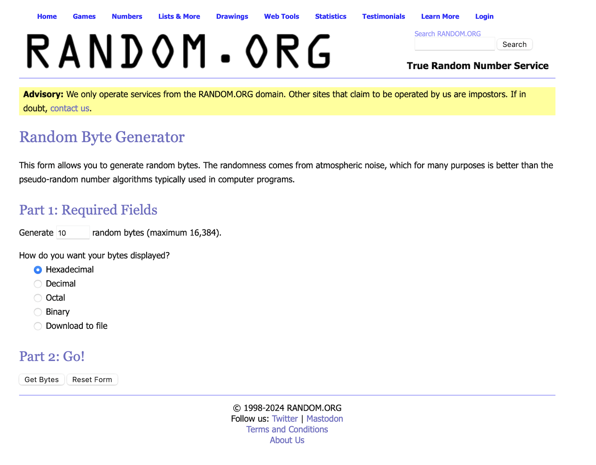

# 🔢 Binary Randomness Test
This procedure is designed to evaluate the randomness of a sequence of bytes generated by a source. The test is conducted using statistical analysis with the help of online tools.

## 🎯 Purpose
The purpose of this procedure is to determine if a given sequence of bytes exhibits characteristics of randomness. It utilizes statistical tests to analyze the distribution of ones and zeros within the byte sequence.

## Tools Used
- Selenium: For web automation to interact with online tools.
- Requests: For making HTTP requests.
- Chrome WebDriver: Used for browser automation.

## Procedure Overview
- Record the start time of the procedure.
- Initialize the WebDriver for Chrome.
- Navigate to random.org to generate a sequence of random bytes.

- Configure the byte generation settings (e.g., number of bytes).
- Retrieve the generated byte sequence.
- Format and preprocess the byte sequence.
- Calculate the count of ones and zeros in the sequence.
- Compute the absolute difference between the counts.
- Calculate the test statistic (Sobs).
- Perform statistical analysis using online tools to determine randomness.
- Record the end time of the procedure.
- Calculate the elapsed time of the procedure.

## How to Use
- Ensure Python and the necessary libraries (selenium, requests) are installed.
- Download and configure the appropriate WebDriver for Chrome.
- Run the script and observe the output.
- Interpret the results based on the statistical analysis.

## Note
- This procedure utilizes online tools for statistical analysis. Ensure a stable internet connection.
- Adjust the byte generation settings and statistical parameters as needed.
- Results may vary depending on the randomness of the generated byte sequence.

## License
This procedure is licensed under the MIT License. See the LICENSE file for details.
